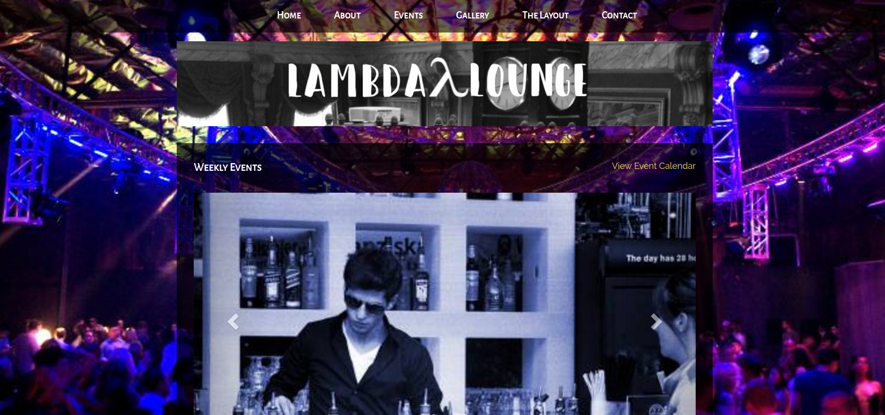

<h1>Lambda Lounge (The Bar)</h1>

Redesign of an existing website, Lambda Lounge is a hypothetical nightclub and the overall concept was to learn to build websites that are unique and eye catching to garner more traffic.
 Live website <a href="https://lambda-lounge.herokuapp.com">here</a>!
 Slideshow with examples of the original website this project was designed from <a href="https://drive.google.com/open?id=1G_M7wHDWVonMl0r54Z1Ays6jN7Z1jqjz0iAR945nPB0">here</a>!

 

<h3>Technologies Used:</h3>

<ul>
<li>AngularJs</li>
<li>HTML</li>
<li>CSS</li>
<li>NodeJs/Express</li>
</ul>

<h3>Approach:</h3>
I did a lot of research into bar and nightclub websites and their overall layouts from Seattle, New York, and Los Angeles. The general go-to's of most of the nightclub sites was to place a lot of content on each page, which was difficult for me as an individual because I like very minimalistic design. I attempted to cater more toward a busy site, as the majority of content on nightclub websites has to do with events, and made sure that most design choices had some type of rhyme or reason in their location. I used AngularJs to render the pages and built the majority of the design specifically in CSS and HTML and only used Bootstrap AngularJS specifically for the carousel. There is no backend as this was spefically to test my ability as a Front End Developer.

<h3>Unsolved Problems:</h3>

<ul>
<li>Awkward alignment of the gallery</li>
<li>Not entirely mobile friendly</li>
</ul>

<h3>Major Hurdles:</h3>
<ul>
<li>Building a website almost entirely without a library (such as Bootstrap or GOogle Material Design) was difficult because I'd relied so heavily on pre-built libraries for much of the course</li>
<li>Nightclub websites are busy with a lot of content,
and attempting to emulate that while making sure things made sense on the page was difficult.
</li>
<li>The carousel took a couple of hours to get working
because, even with the framework of Bootstrap, it was temperamental to get up and running.
</li>

</ul>

